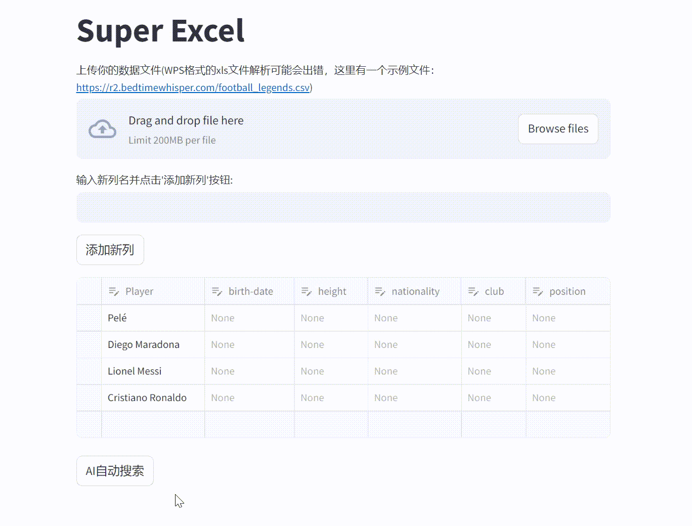

This repository addresses data extraction challenges efficiently.
To get started, simply execute: 

```streamlit run superexcel/main.py```

You will need API keys for OpenAI and Jina.ai to proceed.
Our tool automatically searches for and integrates relevant results to streamline tasks that typically require manual effort.
This demo draws inspiration from:
- [Reworded](https://www.reworkd.ai/)
- [Matrices](https://matrices.app/)
- [Guru](https://www.getguru.ai/)

